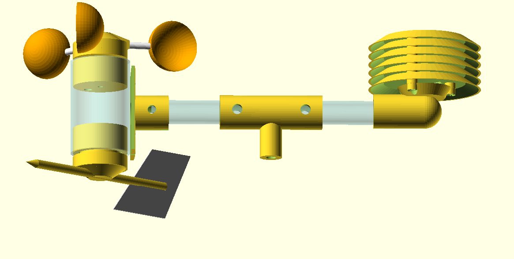
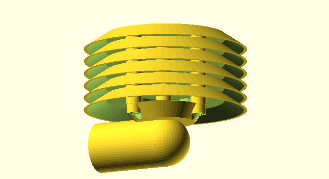
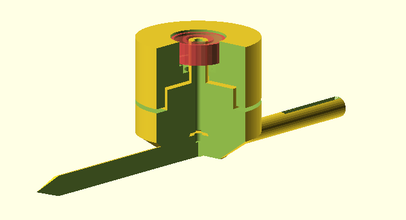
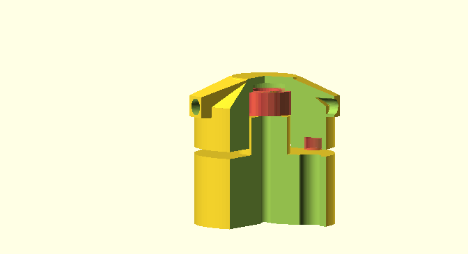
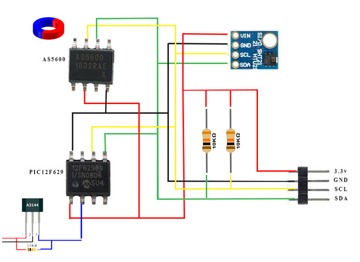
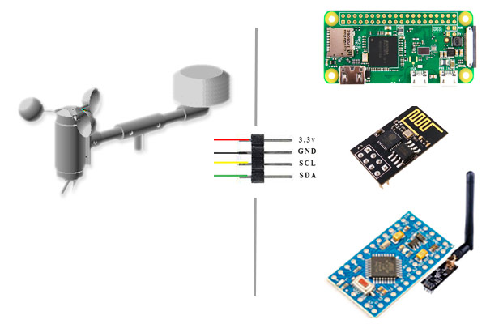

Домашняя метеостанция
---

# Дисклаймер
Данный проект попытка сделать доступный конструктор для сборки простой метеостанции дома.
Большинство деталей распечатаны на 3д принтере. 
Проект полностью открытый, и вы можете изменять его по своему усмотрению.
К сожалению у меня нет возможности оказывать поддержку проекту, поэтому вся представленная здесь информация "as-is". У меня работает, надеюсь у вас получится не хуже. Некую поддержку по работе с электронной частью можно получить посетив телеграм-бот сайта narodmon.ru

# Описание

Метеостанция может определять следующие параметры:

* Силу и направление ветра
* Температуру 
* Влажность

Метеостанция работает по i2c интерфейсу. Все модули подбирались с низким потреблением, для работы на автономном питании. Возможно добавление других модулей или датчиков.

# Конструкция
Конструктивно станция состоит из 3-х модулей - анемометра, флюгера для определения направления ветра и солнечного экрана для защиты датчика температуры от прямых солнечных лучей. Анемометр и флюгер объединены в один корпус. Я использовал отрезок пластиковой водопроводной трубы подходящего диаметра. Для крепления к стойке к трубе прикручен фланец. Блок флюгера с анемометром и экран температурного датчика соединены тонкостенной алюминиевой трубкой, диаметром 10мм, через Т-образный переходник. Такую-же трубку длинной около 1.5 метра я использовал для крепления метеостанции, что-бы отнести её немного дальше от места установки и снизить влияние нагретых предметов (крыша дома) на показания температуры.

## Датчика температуры

Датчик температуры помещён в экран, снижающий влияние солнечных лучей на показания температуры. Экран должен обеспечивать хорошую циркуляцию воздуха вокруг чувствительного элемента для правильной работы датчика, наподобие будки стивенсона.

Экран состоит из нескольких "тарелочек". Тарелочки соединяются вмести и прикручиваются к основанию. Для соединения тарелочек отлично подошли палочки от чупа-чупса. У меня трое детей и они мне часто и с радостью поставляют такого рода DIY материалы. В крайнем случае подойдёт любая палочка 4мм в диаметре. 3 палочки приклеиваются к верхней тарелочке (без сквозных отверстий). Потом набирается любое количество тарелочек с отверстиями, и в конце прикручивается к основанию. 

В качестве датчика подойдёт любой датчик с i2c интерфейсом. Я использовал SHT21. Датчик необходимо закрепить в центре экрана. Проще всего для этого использовать горячий клей. Горячим клеем можно так-же залить и плату датчика (кроме чувствительного элемента). Это защитит электронику от коррозии.
Но увлекаться не стоит. Датчик должен хорошо проветриваться.   

## Датчик направления ветра

Датчик состоит из 2-х частей соединённых через подшипник *686zz* размером 6x13x5 мм (на рисунке выделен красным). Ось флюгера фиксируется маленьким шурупчиком 3 мм. На шляпку шурупа приклеен магнит с __диаметральной__ намагниченностью. Это ВАЖНО ! Обычные магниты работать не будут ! Подходящий магнит можно найти в [механизме настенных стрелочных часов](images/clock.jpeg)

Над магнитом с зазором 1-2 мм закреплена микросхема as5600. Микросхему я припаял на плату-адаптер sop8 to DIP, а саму плату просто закрепил горячим клеем. Я так-же хорошенько залил все щели вокруг платы, это обеспечило дополнительную защиту подшипника от попадания влаги.

Вы можете придумать другой способ крепления. Главное что-бы магнит крутился точно напротив микросхемы с некоторым зазором, и флюгер мог плавно поворачиваться без застреваний. 

Хвостовик можно вырезать из куска листовой пластмассы толщиной в пару миллиметров. Форма может быть любой, главное обратите внимание что-бы хвостовик свободно проходил под креплением. Так-же возможно придётся отцентровать датчик. Я накрутил гайку м6 на стрелку флюгера и перемещая гайку по стрелке добился идеальной центровки.

Провода микросхемы соединил с проводами датчика скорости и вывел наружу через герметичный разъём.

Датчик ветра получился очень чувствительный и поворачивается даже от слабого дуновения, но на практике слабый ветер редко имеет выраженное направление. Показания "скачут". Возможно вы захотите "загрубить" чувствительность, что-бы флюгер не поворачивался при ветре меньше лёгкого (3-4 узла). 

## Датчик скорости ветра

Датчик скорости ветра представляет собой простой счётчик оборотов на датчике холла A3141. Неодимовый магнит, расположенный в подвижной части проходит над датчиком, и микросхема-счётчик считает обороты.

Для подсчёта импульсов можно использовать готовую микросхему типа PCF8583, но можно применить и альтернативный вариант. Для меня накидать [16-битный счётчик с интерфейсом i2c](https://github.com/vt77/PIC12Counter) на маленьком микроконтроллере показалось быстрее (и интереснее) чем ждать заказанные микросхемы. Я применил pic12f629 просто потому, что у меня их была жменя в наличии. Не самый хороший выбор. Такое решение потребовало снизить скорость шины до 10 kHz, но меня устроило. Опрос ведётся не чаще раза в секунду, остальное время микроконтроллер спит. Маленькая скорость шины особо на потребление не повлияла.  

Вы можете применить любое решение. Алгоритм обработки следующий: раз в секунду управляющий блок опрашивает микросхему счётчика и по разности показаний вычисляет скорость. Очень важно откалибровать прибор ! Нам необходимо знать сколько оборотов делает анемометр за 1 метр. Для этого нужно взять анемометр в руки и пройти отмерянную дистанцию (например 5 или 10 метров), считая обороты. Лучше это делать в помещении или хотя-бы в безветренную погоду. Скорость роли не играет. Зная сколько оборотов делает анемометр за 10 метров, не трудно вычислить сколько оборотов сделает анемометр за метр. Это число нам понадобится позже при настройке прошивки.

Механическая часть так-же состоит из 2-х частей. На картинке красным выделены подшипник и магнит. Подшипник такой-же, как и в датчике направления - *686zz* . Под магнитом, в неподвижной части, отверстие для датчика холла.

Подходящий магнит можно найти в маленьких наушниках. В дешёвых правда могут стоять обычные, желательно поискать мощные неодиомовые.

"Чашечки" крыльчатки сделаны из половинок шариков для настольного тенниса. Стойками послужили опят-же палочки от чупа-чупса. Шарики закрепил маленькими шурупами и залил каплей горячего клея. Другой конец стойки вклеил в подвижную часть анемометра. 

После сборки анемометр необходимо отцентровать. Магнит добавит веса на одну сторону. Я центровал навешивая сопли горячего клея на крыльчатку, но думаю можно найти более технологичный способ.

При проектировании я старался спрятать подшипник внутрь конструкции что-бы затруднить доступ влаги и осадков. Тем не менее подшипник стоит обработать антикоррозийным составом (можно спросить у скейтбордистов или роллеров) т.к. от качества этого подшипника зависит чувствительность и точность показаний анемометра. 

# Cхема

 Схема станции очень простая. Напряжение питания 3.3в или 5в в зависимости от управляющего микроконтроллера. Линии SCL и SDA интерфейса i2c должны быть подтянуты к плюсу питания. Между плюсом и минусом желательно поставть электролитический конденсатор 100-470uF и параллельно ему керамический 100nF (на схеме не указано) для фильтрации по питанию. Хотя при батарейном питании это не обязательно.

 AS5600 включен по типовой схеме. Микросхема может работать в 2-х режимах - от 5в или от 3.3в (на схеме). В случае если вы подключаете станцию к 5в процессору питание AS5600 нужно подавать на первую ножку. При этом потребление микросхемы немного увеличится.

 [Счетчик импульсов для анемометра](https://github.com/vt77/PIC12Counter) построен на микроконтроллере pic12f629. Датчик холла подключен к счётному выводу асинхронного 16 битного таймера. Таким образом микроконтроллер большую часть времени просто спит, считая импульсы во сне, и просыпается только от перепада на линии SCL, для обработки команд по I2C. Датчик холла я использовал A3141. Вообще по даташиту для A3141 минимальное напряжение питания 4.5 вольта. У меня он стабильно работает от 3.3в но, как понимаете, гарантий нет. Неплохие датчики холла можно выпаять из бесколлкекторного привода CD-ROM. Выход датчика холла должен быть подтянут к плюсовой шине питания через резистор 10 кОм.

К монтажу особых требований нет, можно напаять даже "навесным". Единственное стоит не забывать, что станция работает на открытом воздухе. Пыль и дождь могут сильно подпортить здоровье микросхемам. Вода может даже просачиваться под изоляцией проводов. Всё что можно загерметизировать, лучше загерметизировать. Я обильно пользовался горячим клеем.

# Подключение

Возможно множество вариантов подключения метеостанции, в зависимости от ваших предпочтений и возможностей. Я пробовал разные. В первом варианте я просто подключил станцию к Raspberry PI zero W, протянув длинный cat3 кабель с двумя витыми парами. В то время малинка трудилась медиа-центром, и ещё одна небольшая подработка ей не помешала. Опросом датчиков занимался простой скрипт на python. Я не публикую эту версию, особо ничего интересного. Решение однозначно "оверкилл", если у вас ещё нет в парке микрокомпьютера. А если есть то написать скрипт опроса шины по крону думаю не составит труда. 

Следующий вариант реализован на базе esp01. Я люблю этот чип за дешевизну и неплохую вычислительную мощность для такой малышки. Прошивка реализована на Arduino. Раз в секунду опрашивается счётчик скорости ветра и усредняется. С настраиваемым интервалом (минимально 20 секунд) данные со всех датчиков через POST JSON отправляются на сервер. Это может быть ваш личный сервер, или какой-то из публичных сервисов аггрегации данных. В прошивке реализована загрузка данных на сайт narodmon.ru. 
Режим сна я не стал делать т.к. решил переделать проект с WiFi на нечто более эффективное для автономного питания. Вы можете добавить режим сна при желании самостоятельно. Подробнее узнать про вариант на esp и скачать прошивку можно в [репозитории](https://github.com/vt77/WeatherStation-firmware-esp).

Третий вариант прошивки сейчас находится в разработке и тестировании. В нём используется простой микропроцессор (stm32 или atmega) с подключением к NRF24. У меня уже есть NRF24 приёмник в моём проекте wirebus и это получилось очень эффективное по энергопотреблению и удобное решение. Думаю от пары AAA элементов можно добиться пару лет автономной работы. А можно ещё добавить солнечную панель. 
Для широкой публики планирую сделать прошивки с LoRa или BLE. Следите за обновлениями.

# Участие
При разработке данного проекта не ставилось цели как-то его монетизировать. Это исключительно НЕ коммерческий проект для общего пользования. Я осознаю что он далеко не идеальный. Поэтому здоровая критика, а ещё лучше участие профессионалов приветствуются. 

Вы можете сделать *fork*  и отправить мне запрос на слияние с подробным комментарием

# Материалы

* [Прошивка для ESP8266](https://github.com/vt77/WeatherStation-firmware-esp)
* [Счётчик для анемометра pic12](https://github.com/vt77/PIC12Counter)
* [Счётчик для анемометра attiny13](https://github.com/vt77/attiny13Counter)
* [Народный мониторинг narodmon.ru](https://narodmon.ru/)

# Фото 

# License

MIT
